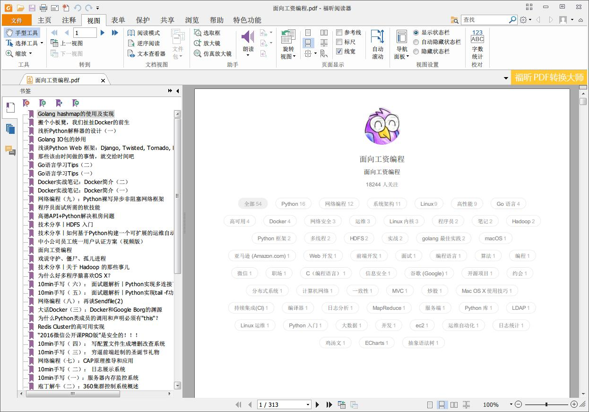
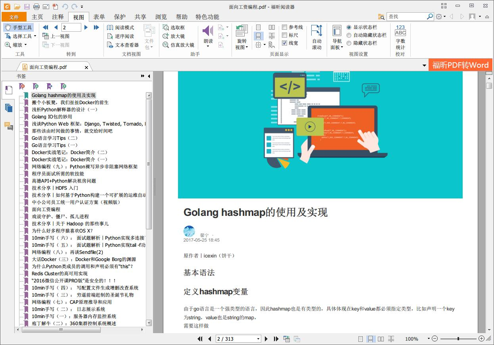

# zhihuzhuanlan2pdf

**知乎专栏 to PDF**。爬取指定的知乎专栏并保存为 PDF 文档。

## 依赖

-   Python 3.6.x
-   Requests
-   beautiful Soup
-   lxml
-   Mako
-   PDFKit
-   wkhtmltopdf

## 安装

>   注：本程序尚未上传到 pypi，所以目前你只能直接下载该仓库源码，然后安装好依赖包（参见 requirement.txt）。
>
>   计划以后做成 Docker 镜像，或上传到 pypi，方便大家下载使用。

1.  下载本仓库源码

2.  确保你安装了Python 3.6.x (本程序只在 Windows 平台，Python 3.6.1 上测试过)

3.  安装依赖的 Python 库

    ```shell
    $ pip install -r requirements.txt
    ```

4.  安装 PDFKit 依赖的程序

    Debian/Ubuntu:

    ```shell
    $ pip install wkhtmltopdf
    ```

    windows 平台去 [wkhtmltopdf 官网](http://wkhtmltopdf.org/)下载对应的Windows版本安装文件安装即可。参加 [PDFKit 项目文档](https://github.com/JazzCore/python-pdfkit)。

## 使用

```shell
$ python start.py {某知乎专栏URL地址}
```

比如我想把“向工资编程”专栏保存为本地 PDF 文件。在知乎上找到给专栏主页，复制该主页的 URL 地址:https://zhuanlan.zhihu.com/auxten

然后：

```shell
$ python start.py https://zhuanlan.zhihu.com/auxten
```

等待一段时间，./out 目录下就好出现`面向工资编程.pdf`文件了。你要抓取专栏的文章越多，等待的时间越长。

本人测试的效果如下：



